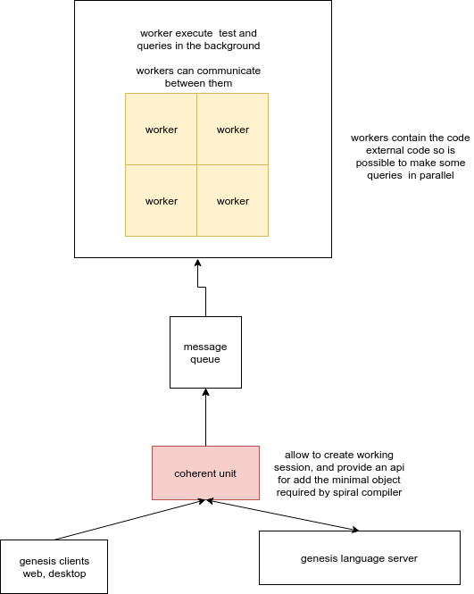

## Genesis architecture

### coherent unit 

is where the genesis object are created or dispatched to the workers

### workers

execute graph query against package or other thing that does not merge, also they execute the test in the background

## genesis client web and desktop 

let code people in browser or update file in the desktop environment

## genesis language server (gls) 

outside of the scope of this package